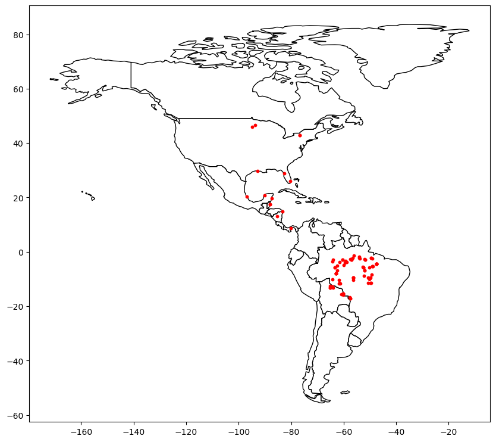
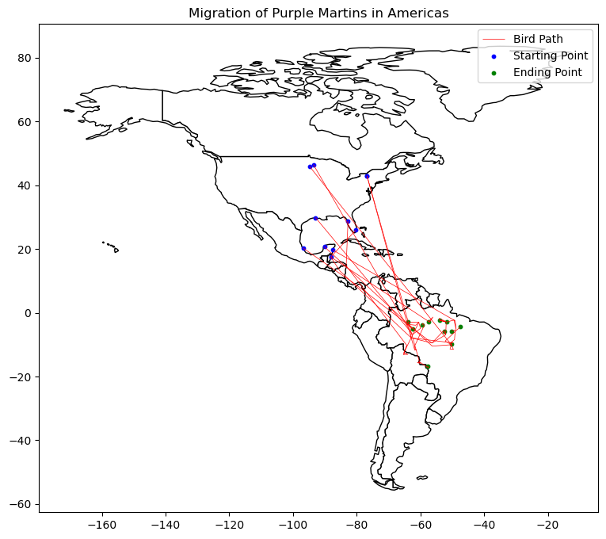
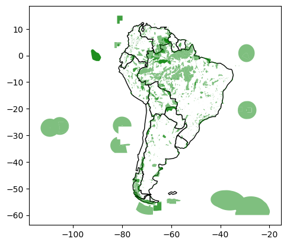
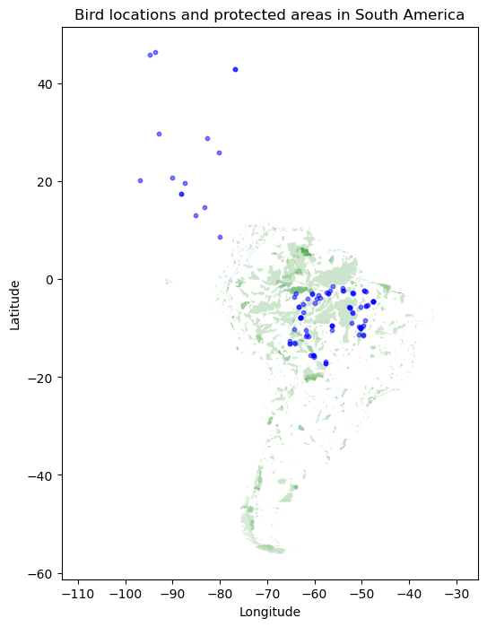

Exercise 2 - Coordinate Reference Systems

<table align="bottom">
  <td>
    <a target="_blank" href="http://localhost:8888/notebooks/3-1%20Data_Mining/exercise2-coordinate-reference-systems.ipynb#">Jupyter에서 실행하기</a>
  </td>
</table>


**This notebook is an exercise in the [Geospatial Analysis](https://www.kaggle.com/learn/geospatial-analysis) course.  You can reference the tutorial at [this link](https://www.kaggle.com/alexisbcook/coordinate-reference-systems).**

---


## Introduction

You are a bird conservation expert and want to understand migration patterns of purple martins.  In your research, you discover that these birds typically spend the summer breeding season in the eastern United States, and then migrate to South America for the winter.  But since this bird is under threat of endangerment, you'd like to take a closer look at the locations that these birds are more likely to visit.

<center>
<br/>
</center>

There are several [protected areas](https://www.iucn.org/theme/protected-areas/about) in South America, which operate under special regulations to ensure that species that migrate (or live) there have the best opportunity to thrive.  You'd like to know if purple martins tend to visit these areas.  To answer this question, you'll use some recently collected data that tracks the year-round location of eleven different birds.

Before you get started, run the code cell below to set everything up.


```python
import pandas as pd
import geopandas as gpd
from shapely.geometry import LineString
import matplotlib.pyplot as plt
```

## Exercises

### Load the data.

다음 코드 셀을 (변경 없이) 실행하여 GPS 데이터를 Panda DataFrame birds_df에 로드합니다.


```python
# Load the data and print the first 5 rows
birds_df = pd.read_csv("C:/Users\seong taek/Desktop/archive/purple_martin.csv", parse_dates=['timestamp']) #  날짜/시간 객체로 읽기
print("There are {} different birds in the dataset.".format(birds_df["tag-local-identifier"].nunique()))

birds_df.head()
```

    There are 11 different birds in the dataset.
    


<div>
<style scoped>
    .dataframe tbody tr th:only-of-type {
        vertical-align: middle;
    }

    .dataframe tbody tr th {
        vertical-align: top;
    }

    .dataframe thead th {
        text-align: right;
    }
</style>
<table border="1" class="dataframe">
  <thead>
    <tr style="text-align: right;">
      <th></th>
      <th>timestamp</th>
      <th>location-long</th>
      <th>location-lat</th>
      <th>tag-local-identifier</th>
    </tr>
  </thead>
  <tbody>
    <tr>
      <th>0</th>
      <td>2014-08-15 05:56:00</td>
      <td>-88.146014</td>
      <td>17.513049</td>
      <td>30448</td>
    </tr>
    <tr>
      <th>1</th>
      <td>2014-09-01 05:59:00</td>
      <td>-85.243501</td>
      <td>13.095782</td>
      <td>30448</td>
    </tr>
    <tr>
      <th>2</th>
      <td>2014-10-30 23:58:00</td>
      <td>-62.906089</td>
      <td>-7.852436</td>
      <td>30448</td>
    </tr>
    <tr>
      <th>3</th>
      <td>2014-11-15 04:59:00</td>
      <td>-61.776826</td>
      <td>-11.723898</td>
      <td>30448</td>
    </tr>
    <tr>
      <th>4</th>
      <td>2014-11-30 09:59:00</td>
      <td>-61.241538</td>
      <td>-11.612237</td>
      <td>30448</td>
    </tr>
  </tbody>
</table>
</div>


데이터 세트에는 11마리의 새가 있으며, 각 새는 "태그-로컬-식별자" 열에서 고유한 값으로 식별됩니다. 각각의 새들은 일년 중 다른 시기에 수집된 여러 개의 측정치를 가지고 있습니다.

다음 코드 셀을 사용하여 GeoDataFrame 새를 만듭니다.  
- birds는 birds_df의 모든 열과 (경도, 위도) 위치를 가진 Point 객체를 포함하는 "기하학" 열을 가져야 합니다 
- 새의 CRS를 {init}: 'epsg:4326'}(으)로 설정합니다..


```python
# Your code here: Create the GeoDataFrame
geometry = [Point(xy) for xy in zip(birds_df["location-long"], birds_df["location-lat"])]
birds = gpd.GeoDataFrame(birds_df, crs="EPSG:4326", geometry=geometry)

# Your code here: Set the CRS to {'init': 'epsg:4326'}
birds.crs = {'init': 'epsg:4326'}
```

    C:\Users\seong taek\anaconda3\lib\site-packages\pyproj\crs\crs.py:141: FutureWarning: '+init=<authority>:<code>' syntax is deprecated. '<authority>:<code>' is the preferred initialization method. When making the change, be mindful of axis order changes: https://pyproj4.github.io/pyproj/stable/gotchas.html#axis-order-changes-in-proj-6
      in_crs_string = _prepare_from_proj_string(in_crs_string)
    


```python
birds.head()
```


<div>
<style scoped>
    .dataframe tbody tr th:only-of-type {
        vertical-align: middle;
    }

    .dataframe tbody tr th {
        vertical-align: top;
    }

    .dataframe thead th {
        text-align: right;
    }
</style>
<table border="1" class="dataframe">
  <thead>
    <tr style="text-align: right;">
      <th></th>
      <th>timestamp</th>
      <th>location-long</th>
      <th>location-lat</th>
      <th>tag-local-identifier</th>
      <th>geometry</th>
    </tr>
  </thead>
  <tbody>
    <tr>
      <th>0</th>
      <td>2014-08-15 05:56:00</td>
      <td>-88.146014</td>
      <td>17.513049</td>
      <td>30448</td>
      <td>POINT (-88.14601 17.51305)</td>
    </tr>
    <tr>
      <th>1</th>
      <td>2014-09-01 05:59:00</td>
      <td>-85.243501</td>
      <td>13.095782</td>
      <td>30448</td>
      <td>POINT (-85.24350 13.09578)</td>
    </tr>
    <tr>
      <th>2</th>
      <td>2014-10-30 23:58:00</td>
      <td>-62.906089</td>
      <td>-7.852436</td>
      <td>30448</td>
      <td>POINT (-62.90609 -7.85244)</td>
    </tr>
    <tr>
      <th>3</th>
      <td>2014-11-15 04:59:00</td>
      <td>-61.776826</td>
      <td>-11.723898</td>
      <td>30448</td>
      <td>POINT (-61.77683 -11.72390)</td>
    </tr>
    <tr>
      <th>4</th>
      <td>2014-11-30 09:59:00</td>
      <td>-61.241538</td>
      <td>-11.612237</td>
      <td>30448</td>
      <td>POINT (-61.24154 -11.61224)</td>
    </tr>
  </tbody>
</table>
</div>


### Plot the data.

다음으로 GeoPandas의 'naturalearth_lowres' 데이터 세트를 로드하고 미주(북남미 모두)의 모든 국가 경계를 포함하는 GeoDataFrame으로 미주를 설정합니다. 변경하지 않고 다음 코드 셀을 실행합니다.


```python
# Load a GeoDataFrame with country boundaries in North/South America, print the first 5 rows
world = gpd.read_file(gpd.datasets.get_path('naturalearth_lowres'))
americas = world.loc[world['continent'].isin(['North America', 'South America'])]
americas.head()
```


<div>
<style scoped>
    .dataframe tbody tr th:only-of-type {
        vertical-align: middle;
    }

    .dataframe tbody tr th {
        vertical-align: top;
    }

    .dataframe thead th {
        text-align: right;
    }
</style>
<table border="1" class="dataframe">
  <thead>
    <tr style="text-align: right;">
      <th></th>
      <th>pop_est</th>
      <th>continent</th>
      <th>name</th>
      <th>iso_a3</th>
      <th>gdp_md_est</th>
      <th>geometry</th>
    </tr>
  </thead>
  <tbody>
    <tr>
      <th>3</th>
      <td>37589262.0</td>
      <td>North America</td>
      <td>Canada</td>
      <td>CAN</td>
      <td>1736425</td>
      <td>MULTIPOLYGON (((-122.84000 49.00000, -122.9742...</td>
    </tr>
    <tr>
      <th>4</th>
      <td>328239523.0</td>
      <td>North America</td>
      <td>United States of America</td>
      <td>USA</td>
      <td>21433226</td>
      <td>MULTIPOLYGON (((-122.84000 49.00000, -120.0000...</td>
    </tr>
    <tr>
      <th>9</th>
      <td>44938712.0</td>
      <td>South America</td>
      <td>Argentina</td>
      <td>ARG</td>
      <td>445445</td>
      <td>MULTIPOLYGON (((-68.63401 -52.63637, -68.25000...</td>
    </tr>
    <tr>
      <th>10</th>
      <td>18952038.0</td>
      <td>South America</td>
      <td>Chile</td>
      <td>CHL</td>
      <td>282318</td>
      <td>MULTIPOLYGON (((-68.63401 -52.63637, -68.63335...</td>
    </tr>
    <tr>
      <th>16</th>
      <td>11263077.0</td>
      <td>North America</td>
      <td>Haiti</td>
      <td>HTI</td>
      <td>14332</td>
      <td>POLYGON ((-71.71236 19.71446, -71.62487 19.169...</td>
    </tr>
  </tbody>
</table>
</div>


- 다음 코드 셀을 사용하여 (1) Americas GeoDataFrame의 국가 경계와 (2) birds_gdf GeoDataFrame의 모든 점을 모두 표시하는 단일 플롯을 만듭니다.

- 여기서는 특별한 스타일에 대해 걱정하지 말고 모든 데이터가 올바르게 로드되었는지 신속하게 확인하기 위해 예비 플롯을 작성하면 됩니다. 특히 새를 구별하기 위해 포인트를 컬러 코딩하는 것에 대해 걱정할 필요가 없으며, 시작 포인트와 끝점을 구분할 필요가 없습니다. 우리는 연습의 다음 부분에서 그것을 할 것입니다.


```python
### Your code here

# figure 객체와 axis 객체를 생성합니다.
fig, ax = plt.subplots(figsize=(10, 10))

# americas GeoDataFrame의 경계를 표시합니다.
americas.plot(ax=ax, color='white', edgecolor='black')

# birds GeoDataFrame의 점을 표시합니다.
birds.plot(ax=ax, markersize=10, color='red')

# 그래프를 출력합니다.
plt.show()
```


    

    


### Where does each bird start and end its journey? (Part 1)

이제, 우리는 각각의 새들의 경로를 더 자세히 볼 준비가 되었습니다. 다음 코드 셀을 실행하여 두 개의 GeoDataFrames를 만듭니다:
- path_gdf에는 각 새의 경로를 표시하는 LineString 개체가 포함되어 있습니다.
- LineString() 메서드를 사용하여 점 객체 목록에서 LineString 객체를 만듭니다.
- start_gdf는 각 새의 시작점을 포함합니다.


```python
# GeoDataFrame showing path for each bird
path_df = birds.groupby("tag-local-identifier")['geometry'].apply(list).apply(lambda x: LineString(x)).reset_index()
path_gdf = gpd.GeoDataFrame(path_df, geometry=path_df.geometry)
path_gdf.crs = {'init' :'epsg:4326'}

# GeoDataFrame showing starting point for each bird
start_df = birds.groupby("tag-local-identifier")['geometry'].apply(list).apply(lambda x: x[0]).reset_index()
start_gdf = gpd.GeoDataFrame(start_df, geometry=start_df.geometry)
start_gdf.crs = {'init' :'epsg:4326'}

# Show first five rows of GeoDataFrame
start_gdf.head()
```

    C:\Users\seong taek\anaconda3\lib\site-packages\pyproj\crs\crs.py:141: FutureWarning: '+init=<authority>:<code>' syntax is deprecated. '<authority>:<code>' is the preferred initialization method. When making the change, be mindful of axis order changes: https://pyproj4.github.io/pyproj/stable/gotchas.html#axis-order-changes-in-proj-6
      in_crs_string = _prepare_from_proj_string(in_crs_string)
    C:\Users\seong taek\anaconda3\lib\site-packages\pyproj\crs\crs.py:141: FutureWarning: '+init=<authority>:<code>' syntax is deprecated. '<authority>:<code>' is the preferred initialization method. When making the change, be mindful of axis order changes: https://pyproj4.github.io/pyproj/stable/gotchas.html#axis-order-changes-in-proj-6
      in_crs_string = _prepare_from_proj_string(in_crs_string)
    


<div>
<style scoped>
    .dataframe tbody tr th:only-of-type {
        vertical-align: middle;
    }

    .dataframe tbody tr th {
        vertical-align: top;
    }

    .dataframe thead th {
        text-align: right;
    }
</style>
<table border="1" class="dataframe">
  <thead>
    <tr style="text-align: right;">
      <th></th>
      <th>tag-local-identifier</th>
      <th>geometry</th>
    </tr>
  </thead>
  <tbody>
    <tr>
      <th>0</th>
      <td>30048</td>
      <td>POINT (-90.12992 20.73242)</td>
    </tr>
    <tr>
      <th>1</th>
      <td>30054</td>
      <td>POINT (-93.60861 46.50563)</td>
    </tr>
    <tr>
      <th>2</th>
      <td>30198</td>
      <td>POINT (-80.31036 25.92545)</td>
    </tr>
    <tr>
      <th>3</th>
      <td>30263</td>
      <td>POINT (-76.78146 42.99209)</td>
    </tr>
    <tr>
      <th>4</th>
      <td>30275</td>
      <td>POINT (-76.78213 42.99207)</td>
    </tr>
  </tbody>
</table>
</div>


다음 코드 셀을 사용하여 각 새의 최종 위치를 포함하는 GeoDataFrame end_gdf를 만듭니다.  
- 형식은 start_gdf의 형식과 동일해야 하며 두 개의 열("태그-로컬 식별자") 및 ("기하학")열에 점 객체가 포함되어 있어야 합니다.
- end_gdf의 CRS를 {init}: 'epsg:4326'}(으)로 설정합니다.


```python
# Your code here
end_df = birds.groupby("tag-local-identifier")['geometry'].apply(list).apply(lambda x: x[-1]).reset_index()
end_gdf = gpd.GeoDataFrame(end_df, geometry=end_df.geometry)
end_gdf.columns = ['tag-local-identifier', 'geometry']

end_gdf
```


<div>
<style scoped>
    .dataframe tbody tr th:only-of-type {
        vertical-align: middle;
    }

    .dataframe tbody tr th {
        vertical-align: top;
    }

    .dataframe thead th {
        text-align: right;
    }
</style>
<table border="1" class="dataframe">
  <thead>
    <tr style="text-align: right;">
      <th></th>
      <th>tag-local-identifier</th>
      <th>geometry</th>
    </tr>
  </thead>
  <tbody>
    <tr>
      <th>0</th>
      <td>30048</td>
      <td>POINT (-47.53632 -4.43758)</td>
    </tr>
    <tr>
      <th>1</th>
      <td>30054</td>
      <td>POINT (-62.47914 -5.03840)</td>
    </tr>
    <tr>
      <th>2</th>
      <td>30198</td>
      <td>POINT (-57.46417 -2.77617)</td>
    </tr>
    <tr>
      <th>3</th>
      <td>30263</td>
      <td>POINT (-50.19230 -5.70504)</td>
    </tr>
    <tr>
      <th>4</th>
      <td>30275</td>
      <td>POINT (-57.70404 -16.72336)</td>
    </tr>
    <tr>
      <th>5</th>
      <td>30300</td>
      <td>POINT (-50.22547 -9.84450)</td>
    </tr>
    <tr>
      <th>6</th>
      <td>30304</td>
      <td>POINT (-52.55503 -5.85648)</td>
    </tr>
    <tr>
      <th>7</th>
      <td>30380</td>
      <td>POINT (-63.98744 -2.93250)</td>
    </tr>
    <tr>
      <th>8</th>
      <td>30384</td>
      <td>POINT (-51.85126 -2.90570)</td>
    </tr>
    <tr>
      <th>9</th>
      <td>30445</td>
      <td>POINT (-53.97454 -2.35599)</td>
    </tr>
    <tr>
      <th>10</th>
      <td>30448</td>
      <td>POINT (-59.50059 -3.91805)</td>
    </tr>
  </tbody>
</table>
</div>


### Where does each bird start and end its journey? (Part 2)

위 질문(path_gdf, start_gdf 및 end_gdf)의 GeoDataFrames를 사용하여 모든 새의 경로를 단일 맵에 시각화합니다. 또한 미주 지역 데이터 프레임을 사용할 수도 있습니다.


```python
### Your code here

# americas GeoDataFrame을 사용하여 미주 지역 지도를 만듭니다
ax = americas.plot(figsize=(12,8), color='white', edgecolor='black')

# path_gdf, start_gdf, end_gdf GeoDataFrame을 사용하여 모든 새의 이동 경로, 출발점 및 도착점을 지도에 추가합니다
path_gdf.plot(ax=ax, color='red', linewidth=0.5)
start_gdf.plot(ax=ax, color='blue', markersize=10)
end_gdf.plot(ax=ax, color='green', markersize=10)

# 제목, 범례 추가
ax.set_title("Migration of Purple Martins in Americas")
ax.legend(['Bird Path', 'Starting Point', 'Ending Point'])

# 출력
plt.show()
```


    

    


### Where are the protected areas in South America? (Part 1)

- 모든 새들이 결국 남아메리카 어딘가에 도착하는 것처럼 보입니다. 하지만 그들은 보호구역으로 갈 것입니까?

- 다음 코드 셀에서는 남미의 모든 보호 영역의 위치를 포함하는 GeoDataFrame protected_areas를 만듭니다. 해당 셰이프 파일은 filepath protected_filepath에 있습니다


```python
# Path of the shapefile to load
protected_filepath = "C:/Users\seong taek/Desktop/archive/SAPA_Aug2019-shapefile/SAPA_Aug2019-shapefile/SAPA_Aug2019-shapefile-polygons.shp"

# Your code here
protected_areas = gpd.read_file(protected_filepath)
protected_areas.head()
```


<div>
<style scoped>
    .dataframe tbody tr th:only-of-type {
        vertical-align: middle;
    }

    .dataframe tbody tr th {
        vertical-align: top;
    }

    .dataframe thead th {
        text-align: right;
    }
</style>
<table border="1" class="dataframe">
  <thead>
    <tr style="text-align: right;">
      <th></th>
      <th>WDPAID</th>
      <th>WDPA_PID</th>
      <th>PA_DEF</th>
      <th>NAME</th>
      <th>ORIG_NAME</th>
      <th>DESIG</th>
      <th>DESIG_ENG</th>
      <th>DESIG_TYPE</th>
      <th>IUCN_CAT</th>
      <th>INT_CRIT</th>
      <th>...</th>
      <th>GOV_TYPE</th>
      <th>OWN_TYPE</th>
      <th>MANG_AUTH</th>
      <th>MANG_PLAN</th>
      <th>VERIF</th>
      <th>METADATAID</th>
      <th>SUB_LOC</th>
      <th>PARENT_ISO</th>
      <th>ISO3</th>
      <th>geometry</th>
    </tr>
  </thead>
  <tbody>
    <tr>
      <th>0</th>
      <td>14067.0</td>
      <td>14067</td>
      <td>1</td>
      <td>Het Spaans Lagoen</td>
      <td>Het Spaans Lagoen</td>
      <td>Ramsar Site, Wetland of International Importance</td>
      <td>Ramsar Site, Wetland of International Importance</td>
      <td>International</td>
      <td>Not Reported</td>
      <td>Not Reported</td>
      <td>...</td>
      <td>Not Reported</td>
      <td>Not Reported</td>
      <td>Not Reported</td>
      <td>Management plan is not implemented and not ava...</td>
      <td>State Verified</td>
      <td>1856</td>
      <td>Not Reported</td>
      <td>NLD</td>
      <td>ABW</td>
      <td>POLYGON ((-69.97523 12.47379, -69.97523 12.473...</td>
    </tr>
    <tr>
      <th>1</th>
      <td>14003.0</td>
      <td>14003</td>
      <td>1</td>
      <td>Bubali Pond Bird Sanctuary</td>
      <td>Bubali Pond Bird Sanctuary</td>
      <td>Bird Sanctuary</td>
      <td>Bird Sanctuary</td>
      <td>National</td>
      <td>Not Reported</td>
      <td>Not Applicable</td>
      <td>...</td>
      <td>Not Reported</td>
      <td>Not Reported</td>
      <td>Not Reported</td>
      <td>Not Reported</td>
      <td>State Verified</td>
      <td>1899</td>
      <td>Not Reported</td>
      <td>NLD</td>
      <td>ABW</td>
      <td>POLYGON ((-70.04734 12.56329, -70.04615 12.563...</td>
    </tr>
    <tr>
      <th>2</th>
      <td>555624439.0</td>
      <td>555624439</td>
      <td>1</td>
      <td>Arikok National Park</td>
      <td>Arikok National Park</td>
      <td>National Park</td>
      <td>National Park</td>
      <td>National</td>
      <td>Not Reported</td>
      <td>Not Applicable</td>
      <td>...</td>
      <td>Non-profit organisations</td>
      <td>Non-profit organisations</td>
      <td>Fundacion Parke Nacional Arikok</td>
      <td>Not Reported</td>
      <td>State Verified</td>
      <td>1899</td>
      <td>Not Reported</td>
      <td>NLD</td>
      <td>ABW</td>
      <td>MULTIPOLYGON (((-69.96302 12.48384, -69.96295 ...</td>
    </tr>
    <tr>
      <th>3</th>
      <td>303894.0</td>
      <td>303894</td>
      <td>1</td>
      <td>Madidi</td>
      <td>Madidi</td>
      <td>Area Natural de Manejo Integrado</td>
      <td>Natural Integrated Management Area</td>
      <td>National</td>
      <td>Not Reported</td>
      <td>Not Applicable</td>
      <td>...</td>
      <td>Federal or national ministry or agency</td>
      <td>Not Reported</td>
      <td>Not Reported</td>
      <td>Not Reported</td>
      <td>State Verified</td>
      <td>1860</td>
      <td>BO-L</td>
      <td>BOL</td>
      <td>BOL</td>
      <td>POLYGON ((-68.59060 -14.43388, -68.59062 -14.4...</td>
    </tr>
    <tr>
      <th>4</th>
      <td>303893.0</td>
      <td>303893</td>
      <td>1</td>
      <td>Apolobamba</td>
      <td>Apolobamba</td>
      <td>Area Natural de Manejo Integado Nacional</td>
      <td>National Natural Integrated Management Area</td>
      <td>National</td>
      <td>Not Reported</td>
      <td>Not Applicable</td>
      <td>...</td>
      <td>Federal or national ministry or agency</td>
      <td>Not Reported</td>
      <td>Not Reported</td>
      <td>Not Reported</td>
      <td>State Verified</td>
      <td>1860</td>
      <td>BO-L</td>
      <td>BOL</td>
      <td>BOL</td>
      <td>POLYGON ((-69.20949 -14.73334, -69.20130 -14.7...</td>
    </tr>
  </tbody>
</table>
<p>5 rows × 29 columns</p>
</div>


### Where are the protected areas in South America? (Part 2)

protected_areas GeoDataFrame을 사용하여 남미의 보호지역 위치를 표시하는 플롯을 만듭니다. (일부 보호지역은 육지에, 다른 보호지역은 해양에 있음을 알 수 있습니다.)


```python
# Country boundaries in South America
south_america = americas.loc[americas['continent']=='South America']

### Your code here: plot protected areas in South America

# 보호지역 데이터를 지도에 그리기
ax = south_america.plot(color='white', edgecolor='black')
protected_areas.plot(ax=ax, alpha=0.5, color='green')

# 플롯 출력하기
plt.show()
```


    

    


###  What percentage of South America is protected?

- 여러분은 남아메리카의 몇 퍼센트가 보호되고 있는지를 결정하는 데 관심이 있습니다. 그래서 여러분은 남아메리카의 어느 정도가 새들에게 적합한지를 알 수 있습니다

- 첫 번째 단계로 남아메리카의 모든 보호 지역(해양 지역 제외)의 총 면적을 계산합니다. 이렇게 하려면 "REP_AREA" 및 "REP_M_AREA" 열을 사용합니다. 여기에는 각각 총 면적과 총 해양 면적이 평방 킬로미터로 포함됩니다.

- 아래 코드 셀을 변경하지 않고 실행합니다.


```python
P_Area = sum(protected_areas['REP_AREA']-protected_areas['REP_M_AREA'])
print("South America has {} square kilometers of protected areas.".format(P_Area))
```

    South America has 5396761.9116883585 square kilometers of protected areas.
    

그런 다음 계산을 마치려면 south_america GeoDataFrame을 사용합니다.  


```python
south_america.head()
```


<div>
<style scoped>
    .dataframe tbody tr th:only-of-type {
        vertical-align: middle;
    }

    .dataframe tbody tr th {
        vertical-align: top;
    }

    .dataframe thead th {
        text-align: right;
    }
</style>
<table border="1" class="dataframe">
  <thead>
    <tr style="text-align: right;">
      <th></th>
      <th>pop_est</th>
      <th>continent</th>
      <th>name</th>
      <th>iso_a3</th>
      <th>gdp_md_est</th>
      <th>geometry</th>
    </tr>
  </thead>
  <tbody>
    <tr>
      <th>9</th>
      <td>44938712.0</td>
      <td>South America</td>
      <td>Argentina</td>
      <td>ARG</td>
      <td>445445</td>
      <td>MULTIPOLYGON (((-68.63401 -52.63637, -68.25000...</td>
    </tr>
    <tr>
      <th>10</th>
      <td>18952038.0</td>
      <td>South America</td>
      <td>Chile</td>
      <td>CHL</td>
      <td>282318</td>
      <td>MULTIPOLYGON (((-68.63401 -52.63637, -68.63335...</td>
    </tr>
    <tr>
      <th>20</th>
      <td>3398.0</td>
      <td>South America</td>
      <td>Falkland Is.</td>
      <td>FLK</td>
      <td>282</td>
      <td>POLYGON ((-61.20000 -51.85000, -60.00000 -51.2...</td>
    </tr>
    <tr>
      <th>28</th>
      <td>3461734.0</td>
      <td>South America</td>
      <td>Uruguay</td>
      <td>URY</td>
      <td>56045</td>
      <td>POLYGON ((-57.62513 -30.21629, -56.97603 -30.1...</td>
    </tr>
    <tr>
      <th>29</th>
      <td>211049527.0</td>
      <td>South America</td>
      <td>Brazil</td>
      <td>BRA</td>
      <td>1839758</td>
      <td>POLYGON ((-53.37366 -33.76838, -53.65054 -33.2...</td>
    </tr>
  </tbody>
</table>
</div>


다음 단계를 수행하여 남미의 총 면적을 계산합니다:
- 각 폴리곤의 면적 속성(CRS로 EPSG 3035 사용)을 사용하여 각 국가의 면적을 계산하고 결과를 합산합니다. 계산된 면적은 제곱미터 단위가 될 것입니다.
- 제곱킬로미터의 단위를 갖도록 답변을 변환합니다


```python
### Your code here: Calculate the total area of South America (in square kilometers)

# CRS를 EPSG 3035로 설정합니다.
south_america = south_america.to_crs(epsg=3035)

# 남미의 면적을 계산합니다.
south_america_area = south_america.area/10**6  # 제곱미터에서 제곱킬로미터로 변환

# 결과를 합산합니다.
total_area = south_america_area.sum()

print("남미의 총 면적은 {:.2f} 제곱킬로미터입니다.".format(total_area))
```

    남미의 총 면적은 17759005.82 제곱킬로미터입니다.
    

아래 코드 셀을 실행하여 보호되는 남미의 백분율을 계산합니다.


```python
# What percentage of South America is protected?
percentage_protected = P_Area/total_area
print('Approximately {}% of South America is protected.'.format(round(percentage_protected*100, 2)))
```

    Approximately 30.39% of South America is protected.
    

### Where are the birds in South America?

그렇다면, 그 새들은 보호 구역에 있을까요?

모든 새들과 남아메리카에서 발견된 모든 위치를 보여주는 플롯을 만듭니다. 또한 남미의 모든 보호 지역의 위치를 표시합니다

순수하게 해양 영역(육지 구성 요소가 없음)인 보호 영역을 제외하려면 "MARINE" 열을 사용하면 됩니다
- To exclude protected areas that are purely marine areas (with no land component), you can use the “MARINE” column (and plot only the rows in protected_areas[protected_areas['MARINE']!='2'], instead of every row in the protected_areas GeoDataFrame).


```python
### Your code here

# 플롯 만들기
fig, ax = plt.subplots(figsize=(12,8))

# 보호구역 (protected_areas[protected_areas['MARINE']!='2'])
protected_areas[protected_areas['MARINE']!='2'].plot(ax=ax, color='green', alpha=0.2)

# 새 위치
birds.plot(ax=ax, markersize=10, color='blue', alpha=0.5)

# 제목
ax.set_title("Bird locations and protected areas in South America")
ax.set_xlabel("Longitude")
ax.set_ylabel("Latitude")

# 그래프 출력
plt.show()
```


    

    


## Keep going

Create stunning **[interactive maps](https://www.kaggle.com/alexisbcook/interactive-maps)** with your geospatial data.

---


*Have questions or comments? Visit the [course discussion forum](https://www.kaggle.com/learn/geospatial-analysis/discussion) to chat with other learners.*
